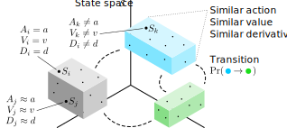

**TripleTree** is a much-extended variant of the CART algorithm, specialised for the task of jointly modelling the policy, value function and temporal dynamics of black box agents in Markov decision processes (MDPs). It was first introduced in [this paper](https://arxiv.org/abs/2009.04743).

 

