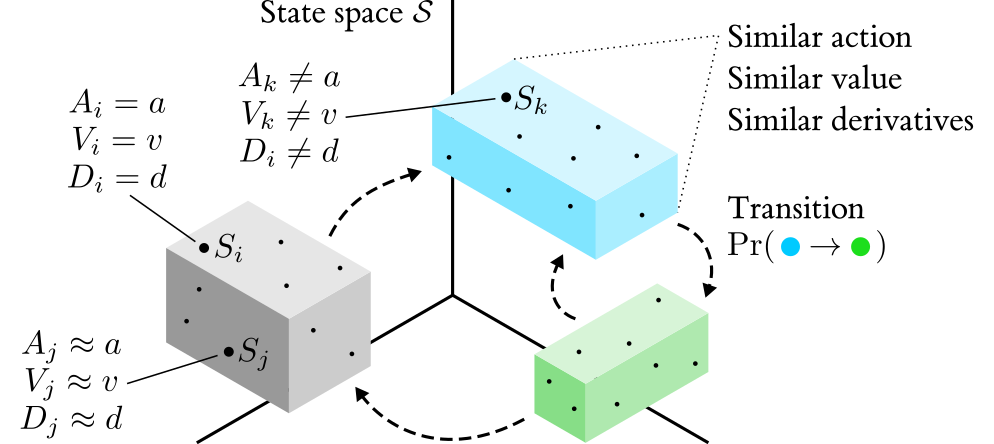

<p align="center">
  
</p>


**TripleTree** is a much-extended variant of the CART algorithm, specialised for the task of jointly modelling the policy, value function and temporal dynamics of black box agents in Markov decision processes (MDPs). It was first introduced in [this paper](https://arxiv.org/abs/2009.04743). 

### Requirements

This implementation is in Python 3.6.9. It just relies on `math`, `itertools`, `numpy`, `scipy`, `pandas` and `matplotlib` for calculations and visualisations. We also use `tqdm` to produce nice progress bars for operations that take some time to complete.

 ### Installation

[COMING SOON]

### Usage

#### Growing a Tree

[COMING SOON]

### Example Scripts

Check out the `examples/` folder for script that reproduce some of the results from our original paper.

### Citation

```
@misc{bewley2020tripletree,
    title={TripleTree: A Versatile Interpretable Representation of Black Box Agents and their Environments},
    author={Tom Bewley and Jonathan Lawry},
    year={2020},
    eprint={2009.04743},
    archivePrefix={arXiv},
    primaryClass={cs.AI}
}
```